# Keypad symbols

| Symbol              | Name        |
| ------------------- | ----------- |
|          | ae          |
| 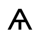         | at          |
| 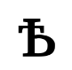          | b           |
| 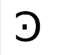 | backwards c |
| 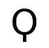    | balloon     |
| 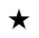  | black star  |
| 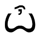       | butt        |
| 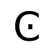   | c with dot  |
| 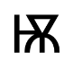        | cat         |
| 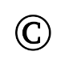  | copyright   |
| 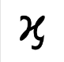     | curly h     |
| 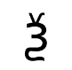     | dragon      |
| 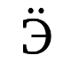       | euro        |
| 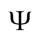       | fork        |
| 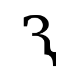  | half three  |
| 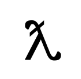     | lambda      |
| 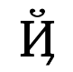    | letter n    |
| 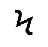  | lightning   |
| 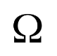      | omega       |
| 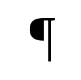  | paragraph   |
| 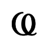    | pig tail    |
| 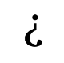   | question    |
| 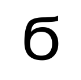        | six         |
| 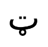     | smiley      |
| 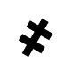     | stitch      |
| 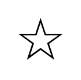  | white star  |